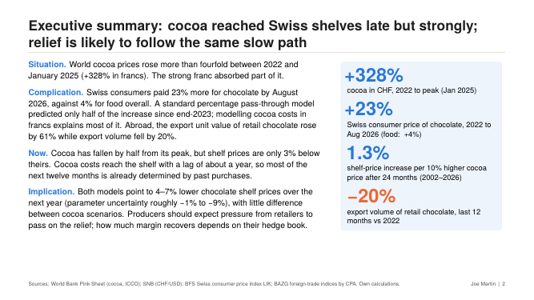
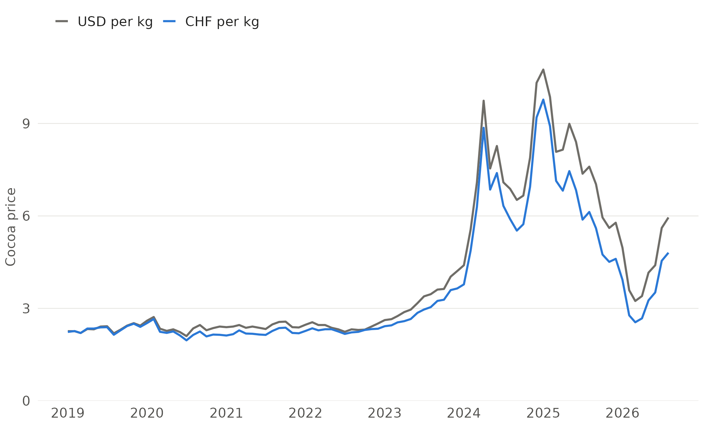
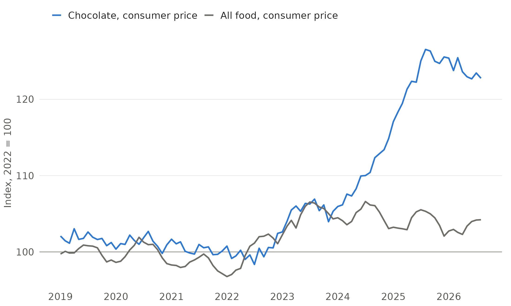
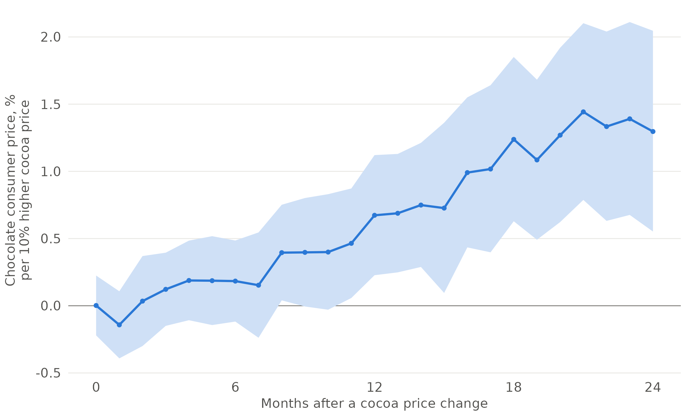
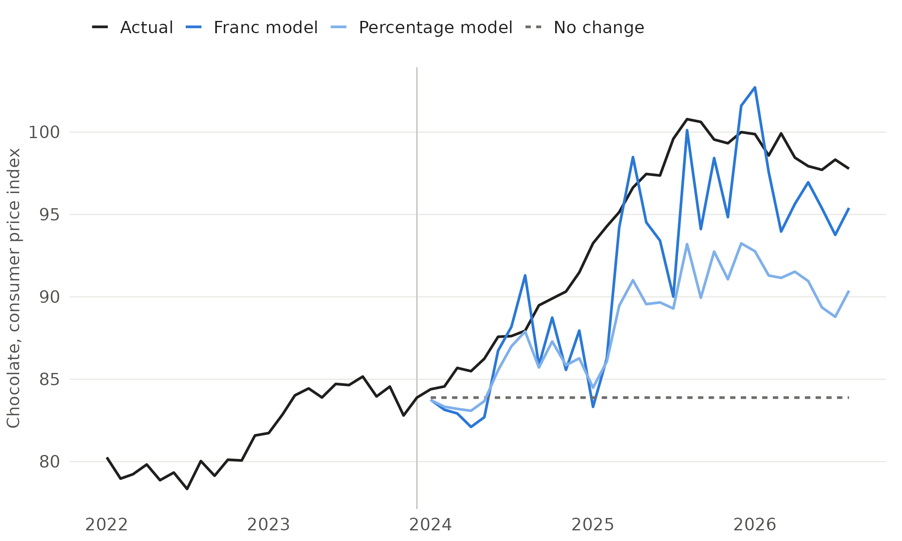
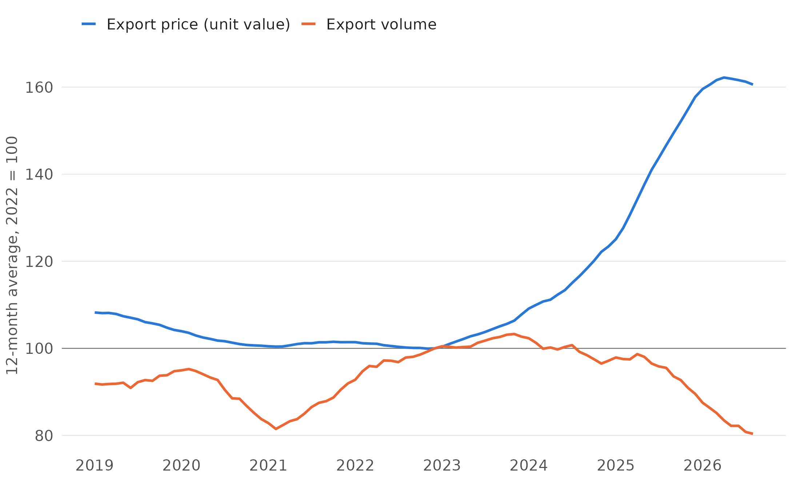
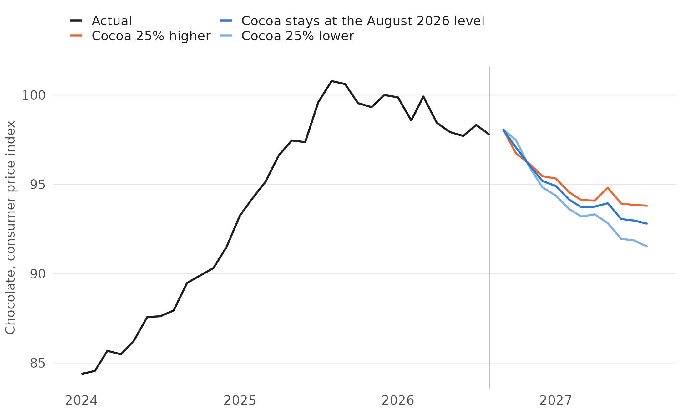

# Cocoa quadrupled. What it did to Swiss chocolate, and what comes next

**A case study with public Swiss data: how fast and how far the 2023–25 cocoa price shock reached Swiss shelf prices and export prices, and what the recent fall in cocoa implies for the next twelve months**

Joe Martin · BSc Food Science & Technology, ETH Zurich · jomartin@ethz.ch

**Slides:** [`deck/Deck_Cocoa_Shock_Swiss_Chocolate.pdf`](deck/Deck_Cocoa_Shock_Swiss_Chocolate.pdf) (10 slides, 16:9)



---

## Summary

- **The shock.** The world cocoa price rose from 2.28 CHF/kg (2022 average) to 9.78 CHF/kg in January 2025 (+328%; in USD +349%). The weaker dollar absorbed part of the increase: the dollar lost 15% against the franc between 2022 and August 2026. In August 2026 cocoa stood at 4.81 CHF/kg, half the peak but still double the 2022 level.
- **Swiss shelf prices.** The consumer price of chocolate (Swiss CPI position 01.1.8.5) rose by 23% from the 2022 average to August 2026, against 4% for food overall. It peaked in August 2025 and has since eased by only 3%.
- **How cocoa costs usually pass through.** From 2002 to 2026, a 10% higher cocoa price (in CHF) went along with about 1.3% higher chocolate shelf prices after 24 months (elasticity 0.14, 95% CI 0.06–0.21). Before 2023 the estimate was 0.9% and less precise. About half of the effect arrived after roughly 12 months. Export unit values of retail chocolate show a larger estimate, 2.3% per 10% (1.0–3.8%), but the intervals overlap.
- **A percentage rule underestimates a shock this large; a franc rule does not.** Estimated on data up to December 2023 and fed with the actual cocoa prices of 2024–26 (a conditional backtest), the percentage model predicted +8% for chocolate shelf prices by August 2026; the actual increase was +17%. A "franc model", which uses the CHF change of cocoa relative to the shelf price (so that the percentage effect grows as cocoa becomes a larger share of costs), predicted +14% (forecast error 4.4% vs 7.0% for the percentage model and 12.9% for "no change"). Both models lag the actual rise by several months. With cocoa frozen at its December 2023 level, a true ex-ante forecast, the model predicted only +4%.
- **Exports.** Over the last 12 months, the export unit value of retail chocolate was 61% above its 2022 level and export volume 20% below (−13% against 2021, −15% against 2019). Bulk chocolate unit values rose by 56% with little volume change against 2022 (−2%), although bulk volumes fluctuate strongly from year to year. Import unit values of cocoa paste, butter and powder rose by 185%. Higher prices are a likely driver of the volume decline, but US tariffs on Swiss goods in 2025 fall in the same period, and unit values also reflect product mix.
- **Outlook.** With cocoa down by half from its peak, both models imply 4–7% lower chocolate shelf prices between August 2026 and August 2027 (percentage model −4.1% to −6.4%, franc model −3.9% to −7.0% across cocoa scenarios of +25%, flat and −25%). Parameter uncertainty alone widens the flat scenario to roughly −1% to −9%. The scenarios differ little because most of the next year is driven by cocoa costs already incurred. No asymmetry between increases and decreases was found in the past (difference 0.03, 95% CI −0.07 to 0.13), but the test cannot rule out a sizable one, and a fall this large is outside historical experience.

**What this could mean for a Swiss chocolate maker** (hypotheses from aggregate data, see slide 9): cocoa has halved while shelf prices fell only 3%, so margins may recover from 2027 depending on the hedge book, and retailers will likely ask for the relief; the export volume loss is concentrated in retail chocolate, with price and US tariffs as likely drivers that call for market-by-market answers; and because pass-through grows with cocoa's cost share, budgets should be set in francs per kg and stress-tested for extreme moves, together with currency risk.

---

## Figures

| | |
|---|---|
|  |  |
| **1** Cocoa price in USD and CHF | **2** Chocolate vs food consumer prices, 2022 = 100 |
|  |  |
| **3** Cumulative pass-through to shelf prices | **4** Conditional backtest from December 2023: percentage vs franc model |
|  |  |
| **5** Exports of retail chocolate: price and volume | **6** Outlook to August 2027 under three cocoa scenarios |

---

## Data

| Source | Series | Terms of use |
|---|---|---|
| World Bank, Commodity Price Data (Pink Sheet), monthly, updated 2 September 2026 | Cocoa (ICCO indicator price), sugar (world), USD/kg | CC BY 4.0 |
| Swiss National Bank, data portal, cube `devkum` | CHF per USD, monthly average | Non-commercial use with source attribution |
| Federal Statistical Office (BFS), LIK detailed results since 1982 (`su-d-05.02.66`, basket 2025, December 2025 = 100), published 3 September 2026 | Chocolate (01.1.8.5), food (01.1), total | OPEN-BY: free use with source attribution |
| Federal Office for Customs and Border Security (BAZG), foreign-trade indices by CPA (opendata.swiss), status 10 September 2026 | Chain-linked value, unit value and volume indices, 2012–2026, for CPA 10.82 (cocoa, chocolate, sugar confectionery) and subgroups | Free use with source attribution; commercial use only with permission |

The BAZG files in `data/raw/` are extracts of the full national files (all rows for CPA codes starting with 108 for exports; 0, 0127 and 1082 for imports), made because the full files are over 100 MB. CPA labels follow Eurostat's CPA 2.1: 10.82.1 cocoa paste, butter and powder; 10.82.21 chocolate in bulk forms; 10.82.22 chocolate other than in bulk forms (retail packs); 10.82.23 sugar confectionery without cocoa. Raw files and SHA-256 checksums: `results/input_manifest.csv`.

---

## Methods

**Pass-through model (percentage model).** Monthly log change of the chocolate CPI regressed on the current and 24 lagged monthly log changes of the cocoa price in CHF, the log change of the food CPI and calendar-month effects (2002–2026, 295 months; OLS with Newey–West standard errors, lag 12). The cumulative sum of the cocoa coefficients is the pass-through elasticity after *k* months (`results/q1_passthrough_cumulative.csv`); "1.3% per 10%" is 1.1^0.135 − 1. Residuals are negatively autocorrelated (lag-1 −0.38); plain OLS gives a wider interval for the 24-month elasticity (0.004–0.27) than Newey–West (0.06–0.21).

**Franc model.** The same regression with the CHF change in the cocoa price divided by the previous month's shelf-price index instead of the log change. A given franc increase then has a larger percentage effect when cocoa is a larger share of costs (`results/q1_model_comparison.csv`).

**Sensitivity.** Without the food control, with sugar prices, 18 or 30 lags, cocoa in USD, and data up to 2022 only: 24-month elasticity between 0.09 and 0.14 (0.9–1.4% per 10%); the pre-2023 estimate is less precise and its confidence interval includes zero (`results/q1_passthrough_sensitivity.csv`).

**Asymmetry.** Separate lag sums for cocoa increases and decreases: 0.15 vs 0.12; difference 0.03 (95% CI −0.07 to 0.13, p = 0.57).

**Backtest.** Both models estimated on data up to December 2023, then fed with the actual cocoa and food prices of January 2024 – August 2026. This is a conditional backtest (it tests the pass-through relationship, not the ability to forecast cocoa). Ex-ante variant: cocoa frozen at its December 2023 level. Benchmarks: no change and the pre-2024 average drift (`results/q2_backtest_errors.csv`).

**Outlook.** Projection for September 2026 – August 2027 from both full-sample models: past cocoa changes are known, future cocoa follows a one-off step of −25%, 0 or +25% in September 2026, food prices follow their average monthly change, and calendar-month effects are averaged out. Intercept, month effects and food trend together contribute less than +0.5 percentage points; the projected decline comes from cocoa. Parameter uncertainty: 2,000 draws from the Newey–West covariance (`results/q3_projection_uncertainty.csv`). This illustrates what the historical relationship implies; it is not a price forecast for any company.

**Exports.** BAZG chain-linked unit value and volume indices, 12-month moving averages, compared with the 2022 average and, as a check, with 2019, 2021 and 2023 (`results/q4_exports_base_year_sensitivity.csv`). Unit values are border values per quantity and change with product mix. Export-price pass-through: log change of the unit value on 24 lags of cocoa changes and calendar-month effects, without food control (February 2012 – August 2026, 175 months).

---

## Limitations

- **Aggregate data only.** No company costs, contracts, hedges or customer data; the implications on slide 9 are hypotheses to be tested.
- **Shelf prices** in the CPI include imported chocolate and promotions; export unit values mix product types and destinations.
- **Model uncertainty.** The percentage model underestimated this shock; the franc model fits better but is noisier. The projection may be wrong in either direction. Other cost drivers (milk, sugar, energy, wages) are only partly captured through the food price control.
- **Exports** coincide with US tariffs on Swiss goods in 2025; the data cannot separate price and tariff effects.
- **Provisional data.** BAZG values for 2026 are provisional and may be revised.

---

## Reproducibility

```
├── R/Cocoa_Analysis.R          # data preparation, models, backtest, projection, figures
├── scripts/download_data.sh    # re-downloads the raw data (BAZG extracts are filtered on the fly)
├── data/raw/                   # archived raw data (September 2026)
├── results/                    # result tables (CSV), input checksums, R session info
├── figures/                    # figures used in the slides
├── deck/                       # slides (XeLaTeX source and PDF)
└── fonts/                      # TeX Gyre Heros, GUST Font License
```

1. `Rscript R/Cocoa_Analysis.R` from the repository root (packages: data.table, readxl, sandwich, ggplot2, scales).
2. Slides: `cd deck && xelatex Deck_Cocoa_Shock_Swiss_Chocolate.tex` (twice).

---

## Authorship

Research question, analysis decisions and interpretation: Joe Martin. Code, slides and text were drafted with the help of an AI assistant (Claude, Anthropic) and checked, revised and run by the author. All numbers come from the scripts in this repository.

## Licence

- **Code** (`R/`, `scripts/`): MIT, see `LICENSE`.
- **Slides, figures, text and result tables**: CC BY 4.0.
- **Data** in `data/raw/`: © World Bank (CC BY 4.0); © Swiss National Bank (non-commercial use with attribution); © Federal Statistical Office BFS (OPEN-BY); © Federal Office for Customs and Border Security BAZG (free use with attribution, commercial use only with permission). Redistributed unchanged or as documented extracts, with attribution.
- **Fonts**: TeX Gyre Heros, GUST Font License.
